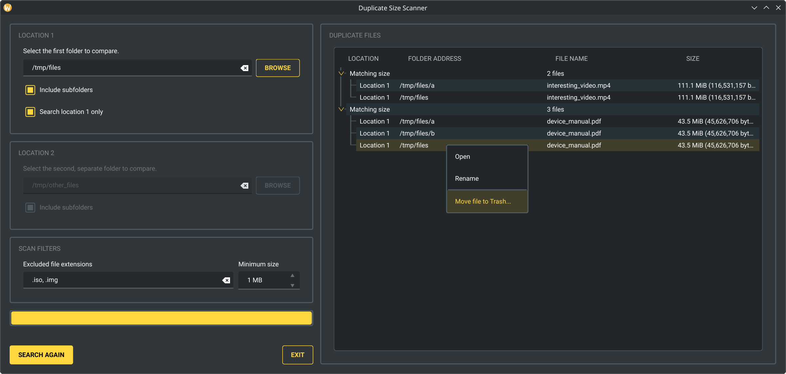

# Duplicate Size Scanner

Duplicate Size Scanner is a PySide6 desktop application that finds files with
identical file sizes. You can compare two folders or find repeated file sizes
within one folder.

## Disclaimer

> [!IMPORTANT]
> Duplicate Size Scanner is intended as a **demonstrative** project only, it is not meant to be considered a production-ready application.

## Screenshot



## Features

- Compare file sizes between two folders.
- Find repeated file sizes within one folder.
- Include or exclude subfolders independently for each location.
- Exclude simple or compound file extensions, such as `.log` or `.tar.gz`.
- Ignore files below a configurable minimum size.
- Display matches from largest to smallest.
- Open, rename or delete individual results.
- Preserve settings between sessions.

## Limitations

- Matching file sizes do not prove that file contents are identical. This application does not compare filenames, hashes or actual file contents.

## Requirements

- Python 3.14 or newer
- Windows or Linux

## Setup and run

Run all commands from the repository root.

### Linux

```bash
python3 -m venv .venv
source .venv/bin/activate
python3 -m pip install -r requirements.txt
python3 src/main.py
```

### Windows PowerShell

```powershell
py -m venv .venv
.\.venv\Scripts\Activate.ps1
py -m pip install -r requirements.txt
py src/main.py
```

## Usage

1. Select **Location 1**.
2. Select **Location 2** or enable **Search location 1 only**.
3. Choose whether each enabled location includes its subfolders.
4. Optionally enter excluded extensions and a minimum file size.
5. Select **Search**.
6. Right-click a file result to open it, rename it or move it to Trash.

In two-location mode, a result is shown when at least one eligible file of that
size exists in each location. In single-location mode, a result is shown when at
least two eligible files in Location 1 have that size.

The selected folders must be different and must not contain one another. The
scanner ignores zero-byte files, symbolic links, invalid directories, excluded extensions and files below the set minimum size.

The minimum-size field uses decimal megabytes, where `1 MB = 1,000,000 bytes`.

## Settings

The application saves paths and scan options in the platform's user
configuration directory. The settings file is normally stored at:

| Platform | Location                                           |
| -------- | -------------------------------------------------- |
| Linux    | `~/.config/DuplicateSizeScanner/settings.ini`      |
| Windows  | `%LOCALAPPDATA%\DuplicateSizeScanner\settings.ini` |

On Windows, `%LOCALAPPDATA%` usually refers to
`C:\Users\<username>\AppData\Local`.

The file is created when you start a search or close the application. If the
file is missing or malformed, the application uses default values.

## Development

See the [architecture guide](docs/architecture.md) for module boundaries and
runtime flows.

Create the virtual environment as shown in [Setup and run](#setup-and-run),
then install the development and build dependencies:

```bash
python3 -m pip install -r requirements-dev.txt
```

Run the quality checks and tests:

```bash
ruff check --fix
ruff format
pytest
```

The test suite is not complete, it covers basic scanning, filtering, settings persistence, file actions and user-interface behavior.

## Build an executable

PyInstaller builds are platform-specific. Build the Windows executable on
Windows and the Linux executable on Linux. See [the build instructions](docs/building.md) for the commands.

## License

Duplicate Size Scanner is available under the [MIT License](LICENSE).
