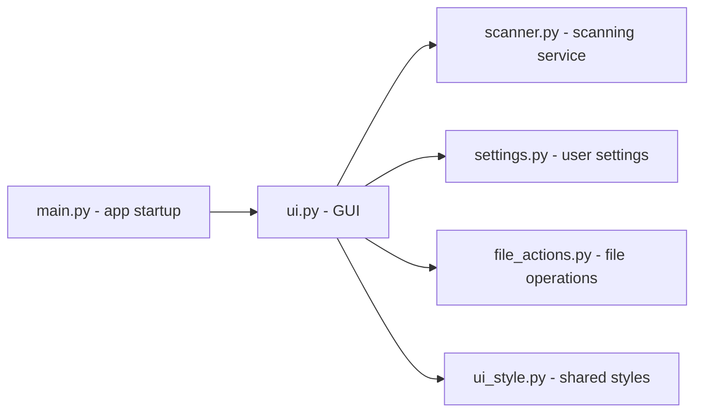
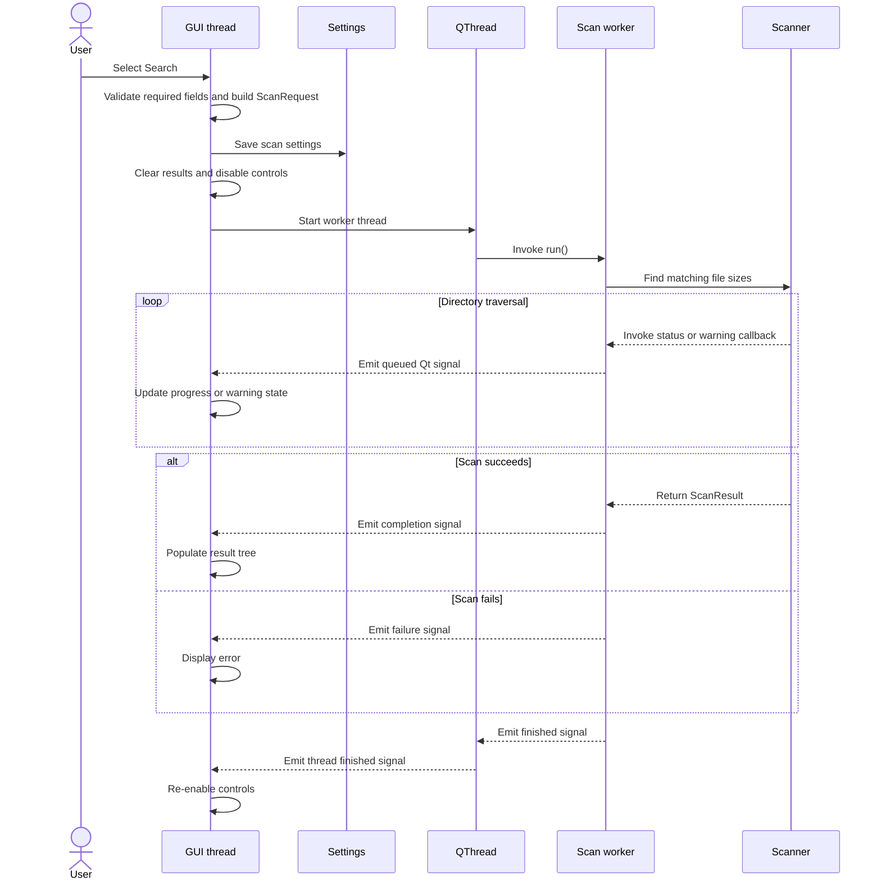

# Architecture

Duplicate Size Scanner uses a small layered desktop architecture. The GUI coordinates application services while scanning logic and file operations remain separate from the GUI.

## Module responsibilities

| Module | Responsibility |
| --- | --- |
| `src/main.py` | Configures Qt and some basic logging, applies the theme, creates the main window and starts the event loop. |
| `src/ui.py` | Builds the interface which handles user input, manages the scan worker and displays results and errors. |
| `src/scanner.py` | Traverses paths, filters files and groups files by file size. |
| `src/settings.py` | Loads and saves user-specific application settings in a `.ini` file. |
| `src/file_actions.py` | Validates result paths and performs OS native open, rename and delete operations. |
| `src/ui_style.py` | Defines shared palette tokens and recurring Qt stylesheet builders. |

`src/ui.py` is the composition layer. It depends on the other application
modules, but the scanner does not depend on Qt and can be used and tested independently.

## Module map

## Scan lifecycle

The scanner runs synchronously inside a worker object on a `QThread`. Qt
signals transfer status, warnings, results and failures back to the GUI thread.

